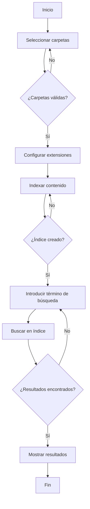

# FastFinder

FastFinder es una aplicación de búsqueda de texto desarrollada en Python utilizando PyQt5 para la interfaz gráfica y Whoosh como motor de búsqueda.

## Funcionalidades

- Búsqueda de texto en múltiples archivos
- Soporte para múltiples extensiones de archivo
- Indexación de contenido para búsquedas rápidas
- Interfaz gráfica intuitiva

## Requisitos

- Python 3.8 o superior
- PyQt5
- Whoosh

## Instalación

1. Clona el repositorio
2. Instala las dependencias:
```bash
pip install -r requirements.txt
```
3. Ejecuta la aplicación:
```bash
python app.py
```

## Diagrama de flujo



## Uso

1. Selecciona las carpetas a indexar
2. Configura las extensiones de archivo
3. Indexa el contenido
4. Realiza búsquedas de texto

## Contribución

¡Las contribuciones son bienvenidas! Por favor, abre un issue o envía un pull request.

## Licencia

MIT